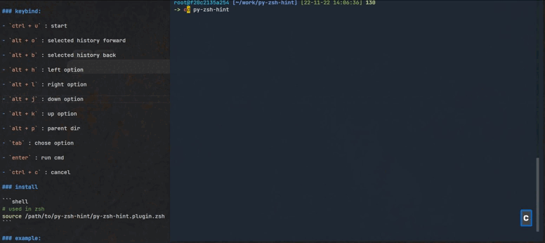

## py-zsh-hint.plugin.zsh

### keybind:

- `ctrl + u` : start

- `alt + h` : selected history back

- `alt + l` : selected history forward

- `alt + j` : next option

- `alt + k` : last option

- `alt + b` : parent dir

- `tab` : chose option

- `enter` : run cmd

- `ctrl + c` : cancel

### install

```shell
# used in zsh
source /path/to/py-zsh-hint/py-zsh-hint.plugin.zsh
```

### example:

